# Thonny 软件下载安装和使用方法

在开始构建项目之前，你需要首先做一些准备，这是非常重要的，你不能跳过。

<span style="color: rgb(255, 76, 65);">**特别注意：**</span>下面两个压缩包文件一定要下载，后面会用到。

[1.Python_固件](1.Python_固件.zip)

[2.项目课程](2.项目课程.zip)

## 一、安装Thonny(重要)：

Thonny是一个免费、开源的软件平台，体积小，界面简单，操作简单，功能丰富，是一个适合初学者的Python IDE。在本教程中，我们使用这个IDE在整个过程中开发ESP32。Thonny支持多种操作系统，包括Windows, Mac OS,  Linux。
### 1.下载Thonny软件：

(1) 进入软件官网：[https://thonny.org](https://thonny.org) 下载Thonny软件，最好下载最新版的，否则可能不支持ESP32.

(2) Thonny的开源代码库：[https://github.com/thonny/thonny](https://github.com/thonny/thonny)

请按照官网的指导安装或点击下面的链接下载安装。(请根据您的操作系统选择相应的选项.)

|操作系统|下载链接/方法|
| :--: | :--: |
|MAC OS：|[https://github.com/thonny/thonny/releases/download/v3.2.7/thonny-3.2.7.pkg](https://github.com/thonny/thonny/releases/download/v3.2.7/thonny-3.2.7.pkg)|
|Windows：|[https://github.com/thonny/thonny/releases/download/v3.2.7/thonny-3.2.7.exe](hhttps://github.com/thonny/thonny/releases/download/v3.2.7/thonny-3.2.7.exe)|
|Linux：|最新版本:(如下)
```
Binary bundle for PC (Thonny+Python): 
bash <(wget -O - https://thonny.org/installer-for-linux) 
With pip:
pip3 install thonny
Distro packages (may not be the latest version):
Debian, Rasbian, Ubuntu, Mint and others:
sudo apt install thonny
Fedora:
sudo dnf install thonny
```
|


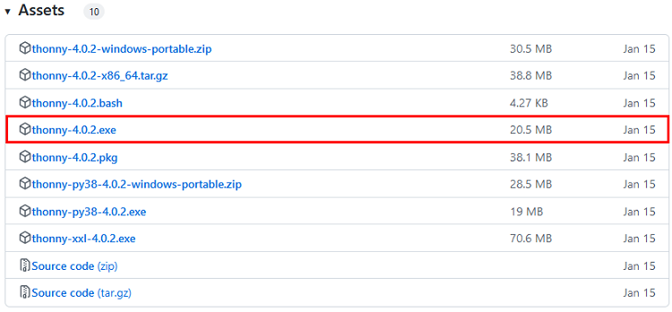

### 2.Windows上安装Thonny软件：
A.下载后的Thonny图标如下。


B.双击“thonny-4.0.2.exe”，会出现下面对话框，我这里是选择“”进行操作的。你也可以选择“”进行操作的。


C.如果您不熟悉电脑软件安装，您可以一直单击“**Next**”直到安装完成。


D.如果您需要更改Thonny软件的安装路径，可以单击“**Browse...**”进行修改。选择安装路径后，单击“**OK**”。如果您不想更改安装路径，只需单击“**Next**”；然后又继续单击“**Next**”。


E.选中“**Create desktop icon**”，Thonny软件会在你的桌面上生成一个快捷方式，方便你稍后打开Thonny软件。


F.单击“**Install**”安装软件。


G.在安装过程中，您只需等待安装完成，千万不要点击“**Cancel**”，否则将无法安装成功。


H.一旦看到如下界面，就表示已经成功安装了Thonny软件，点击“**Finish**”就可以。


I.如果你在安装过程中选择了“**Create desktop icon**”，则可以在桌面上看到如下图标。


## 二、Thonny软件基本配置  

A.双击Thonny软件的桌面图标，可以看到如下界面，同时还可以进行语言选择(<span style="color: rgb(255, 76, 65);">这里选择简体中文</span>)和初始设置。设置完了点击“**Let’s go！**”。


B.选择“**视图**”→“**文件**”和“**Shell**”。


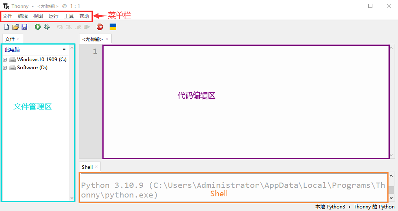

## 三、更新Micropython固件（重要） 

要在树莓派Pico板上运行MicroPython程序，我们需要先烧入一个固件到树莓派Pico板中。

### 1. 为什么我们需要更新固件
树莓派Pico板可以用C语言和MicroPython语言编程，并且树莓派Pico板出厂时没有MicroPython固件，使用MicroPython编程之前需要下载MicroPython固件。

<br>

<span style="color: rgb(255, 76, 65);">注意：MicroPython固件只需要下载一次，当使用MicroPython编程时不需要再次下载。如果你已经下载了用C语言编写的&nbsp;.uf2 程序固件，则MicroPython固件将会被覆盖，那下次你使用MicroPython时，你需要按照以下步骤更新树莓派Pico板的固件。</span>

<br>

### 2. 下载Micropython固件

方法1：树莓派Pico的官网：[https://www.raspberrypi.com/documentation/microcontrollers/](https://www.raspberrypi.com/documentation/microcontrollers/)

A.单击上面的链接，你可以看到以下界面：


B.滚动鼠标，你又可以看到以下内容：

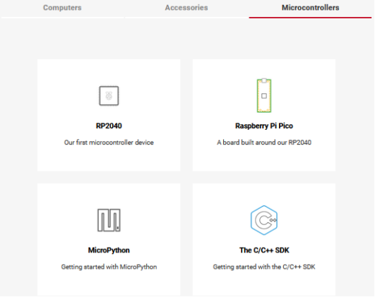

C.单击“<span style="color: rgb(61, 167, 66);">MicroPython(Getting started MicroPython)</span>”进入固件下载页面。

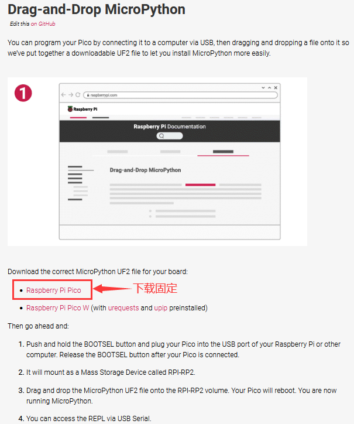

方法2：通过单击下载链接：[https://micropython.org/download/rp2-pico/rp2-pico-latest.uf2](https://micropython.org/download/rp2-pico/rp2-pico-latest.uf2) ，可以直接下载。

方法3：如果你因为网络问题或其他原因无法下载，可以使用我们准备的 .uf2 文件，它位于以下文件路径

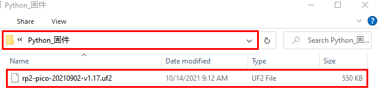

### 3. 烧入MicroPython固件的步骤

①连接microUSB线一端到你的电脑USB口。

②长按“树莓派Pico板”上的白色按钮（BOOTSEL）。然后，通过microUSB线另一端将树莓派Pico板与电脑连接。

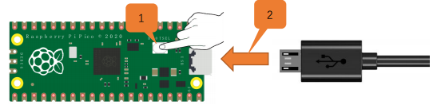

③松开按钮，当连接成功时，在你的电脑上打开[<span style="color: rgb(255, 76, 65);">设备管理器</span>]，电脑将自动识别可移动磁盘(RPI-RP2)，如下所示:

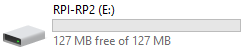

④复制文件（rp2-pico-20210902-v1.17.uf2）到可移动磁盘(RPI-RP2)，并等待它完成，就像复制文件到U盘一样。

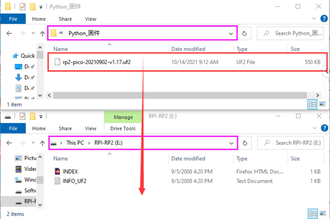

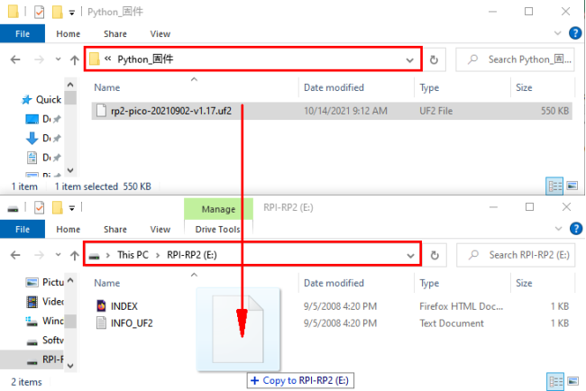

⑤当固件烧入完成后，树莓派Pico板会自动重启。之后，你可以运行Micropython。

## 四、Thonny软件连接上树莓派Pico板

1.打开Thonny软件，点击“运行”并选择“选择解释器…”

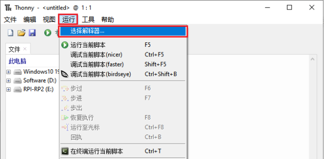

2.选择“Micropython (一般)”或“Micropython (Raspberry Pi Pico)”均可。如何选择“Micropython(Raspberry Pi Pico)”? 如下所示：

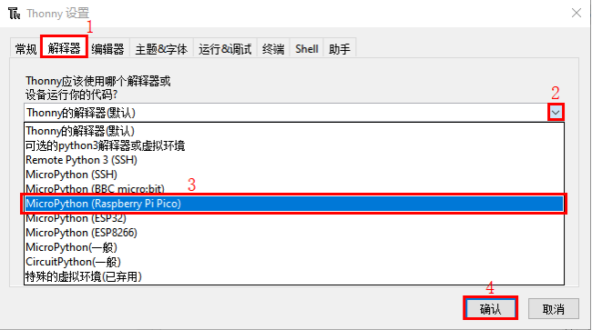

3.选择“USB-SERIAL (COMx)”，“COMx”的编号在不同的电脑之间可能会有所不同。你只需要确保选择“USB-SERIAL (COMx)”就行。
<br>
<span style="color: rgb(255, 76, 65);">如何确定你的树莓派Pico板与电脑通信的端口?</span>
<br>

步骤1: 当你的树莓派Pico板没有连接到电脑时，打开Thonny软件，点击“运行”，选择“选择解释器...”，弹出对话框，点击“端口”，可以查看当前连接的端口，如下图所示:

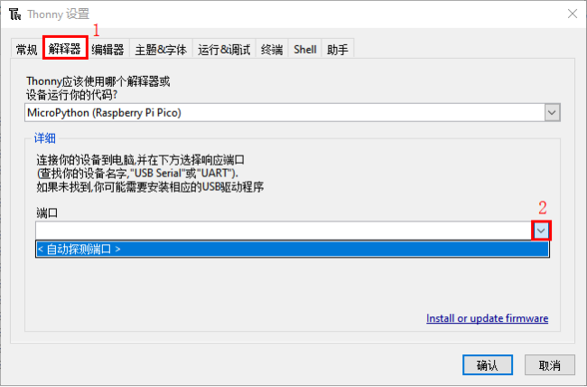

步骤2: 关闭对话框。将树莓派Pico板连接到电脑，再次单击“运行”并选择“选择解释器...”。单击弹出窗口中的“端口”，查看当前端口。现在又增加了一个端口，那么这个端口是用来与电脑通信的。

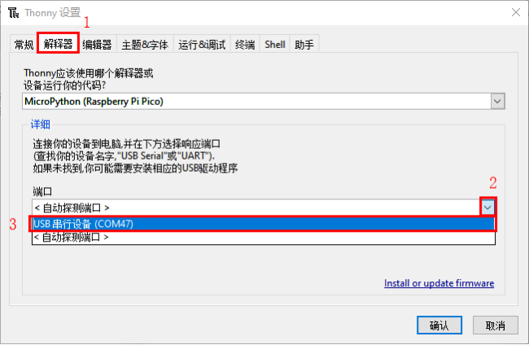

4.选择“Micropython(Raspberry Pi Pico)”和端口后，单击“确定”。


5.当在Thonny软件上显示以下消息时，表明Thonny软件已成功连接到树莓派Pico板。

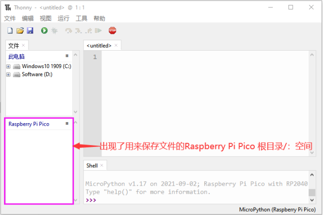

到目前为止，所有的准备工作都已就绪。

## 五、测试代码(重要)  

### 1.测试Shell命令

在“Shell”窗口输入“print(Hello World!)”，按“Enter”键。

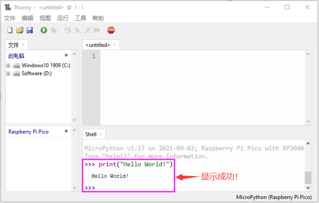

### 2.在线运行代码：

要在线运行树莓派Pico，你需要把树莓派Pico板连接到电脑上。这样就可以使用Thonny软件编译或调试程序。

**优点：**
（1）你可以使用Thonny软件编译或调试程序。

（2）通过“Shell”窗口，你可以查看程序运行过程中产生的错误信息和输出结果，并可以在线查询相关功能信息，帮助改进程序。

**缺点：**

（1）要在线运行树莓派Pico，你必须将树莓派Pico板连接到一台电脑上并和Thonny软件一起运行。

（2）如果树莓派Pico板与电脑断开连接，当它们重新连接时，程序将无法再次运行。

<span style="color: rgb(255, 169, 0);">**基本操作：**</span>

（1）打开Thonny软件，并且单击“打开...”。

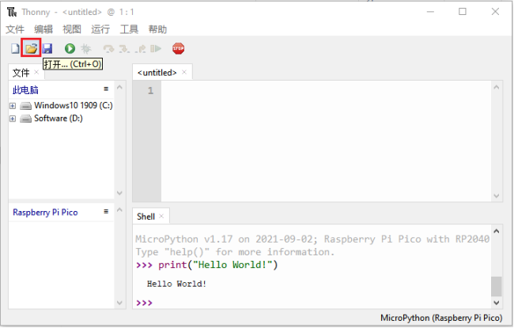

（2）在新弹出的窗口中，点击“此电脑”。

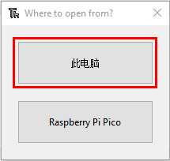

在新的对话框中，进入文件夹..\项目 01：Hello World 选中“Project_01_HelloWorld.py”,单击“Open”。

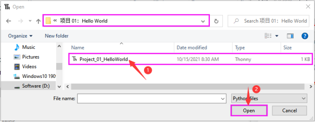

（3）单击“运行当前脚本”来执行程序“Hello World!”, "Welcome Keyestudio" 将打印在“Shell”窗口。

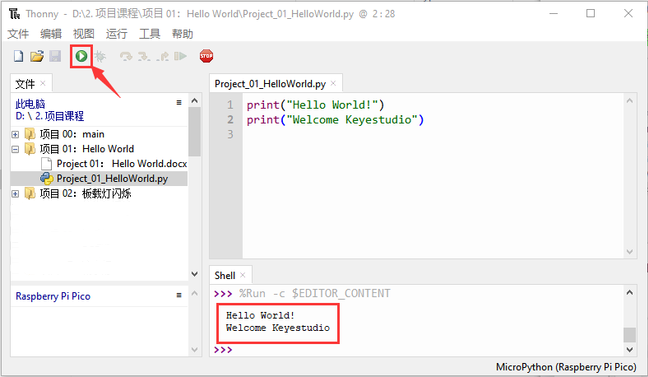

**退出在线运行**

当在线运行时，单击Thonny软件上的
“停止/重启后端进程”或按Ctrl+C退出程序。

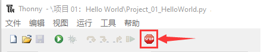

### 3. 离线运行代码：

在离线运行时，树莓派Pico板不需要连接电脑和Thonny软件。一旦上电，它就可以运行存储在树莓派Pico板中的main.py程序。

**优点：**不需要连接电脑和Thonny软件就可以运行程序。

**缺点：**出现错误或树莓派Pico板没电时，程序会自动停止，并且代码不容易更改。

<span style="color: rgb(255, 169, 0);">**基本操作：**</span>

一旦上电后，树莓派Pico板会自动检查设备上是否存在main\.py。如果有，则运行main.py中的程序，然后进入shell命令系统。(如果你想让代码离线运行，你可以将它保存为main\.py); 如果main\.py不存在，则直接进入shell命令系统。

（1）单击 “文件”→“新文件” 创建并编写代码。

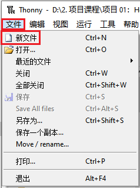

（2）在新打开的文件中输入代码。这里我们以Project_02_Onboard_LED_flashing.py代码为例。


（3）单击菜单栏上的“保存”, 你可以将代码保存到此电脑或Raspberry Pi Pico。

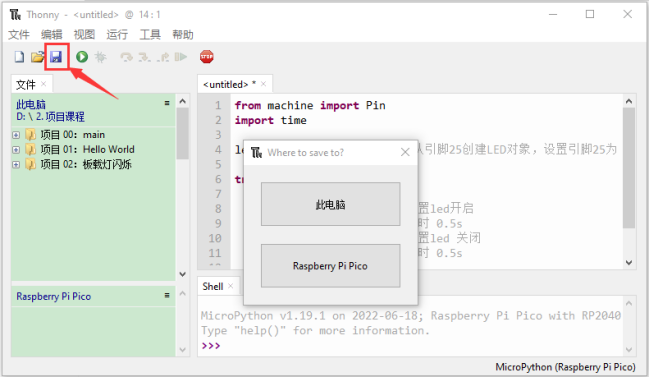

（4）选择“Raspberry Pi Pico”，在新弹出的窗口中输入“main\.py”并单击“确认”。

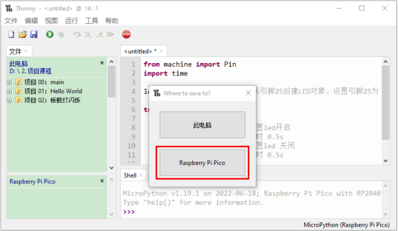


（5）你可以看到代码已经被上传到树莓派Pico板。


（6）断开树莓派Pico板的microUSB线，再重新连接，树莓派Pico板上的LED会反复闪烁。

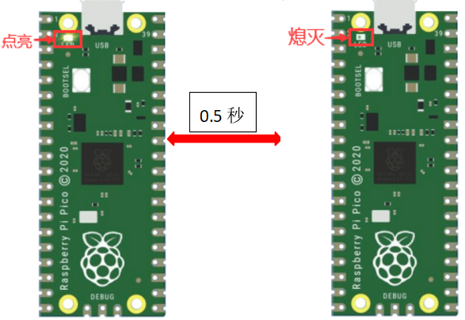

**退出离线运行**

连接树莓派Pico板到电脑，点击Thonny软件上的 “停止/重启后端进程”结束离线运行。

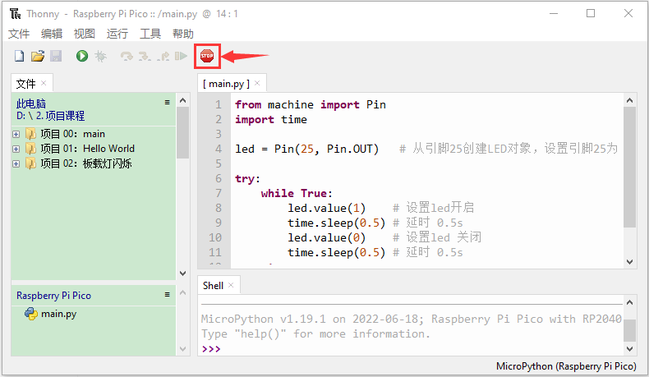

如果它不能工作，请点击Thonny软件上的 “停止/重启后端进程”多次或重新连接树莓派Pico板。

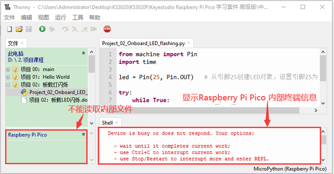

我们提供了一个main.py文件用于离线运行。添加到main.py中的代码是执行用户代码文件的引导程序。你只需要将离线项目的代码文件(.py)上传到“Raspberry Pi Pico”。

① 在项目课程中展开“项目 00：main”，鼠标左键双击main\.py，我们提供的main.py可以使“Raspberry Pi Pico”中的代码离线运行。

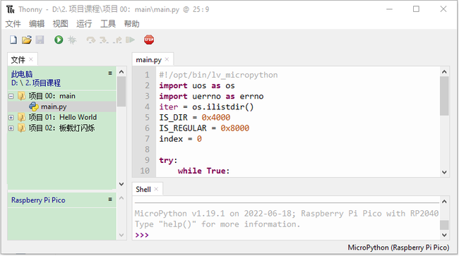

这里，我们使用项目 00和项目 02案例作为演示。使用树莓派Pico板上的LED（GP25引脚）显示结果。如果你已经修改了Project_02_Onboard_LED_flashing.py文件，那么你需要相应地修改它。如下图所示，鼠标右键单击Project_02_Onboard_LED_flashing.py文件，选择“<span style="color: rgb(255, 76, 65);">上载到/</span>“上传代码到 Raspberry Pi Pico。

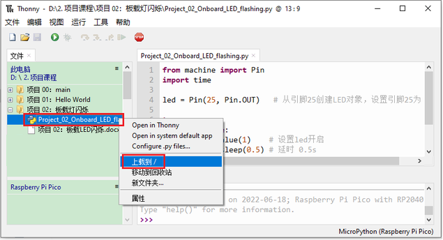

用同样的方法上传main\.py.

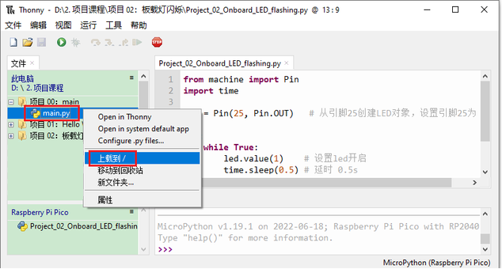

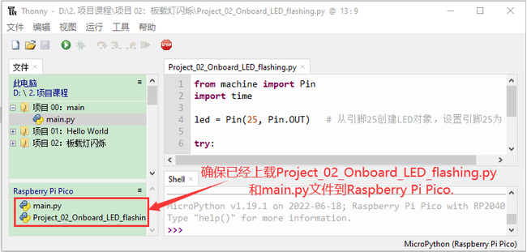

断开树莓派Pico板的microUSB线并重新连接，树莓派Pico板上的LED将反复闪烁。


<span style="color: rgb(255, 76, 65);">**特别注意:** </span>
这里的代码是离线运行的。如果你想停止离线运行并且在“Shell”窗口显示对应信息，只需单击Thonny软件上的
“停止/重启后端进程”。

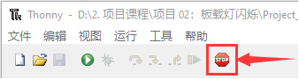

## 六、Thonny常见的操作

### 1. 上传代码至Raspberry Pi Pico

在Project 01：Hello World文件夹中，鼠标右键单击选中Project_01_HelloWorld.py，选择“<span style="color: rgb(255, 169, 0);">上载到/</span>”上传代码到 Raspberry Pi Pico的根目录。

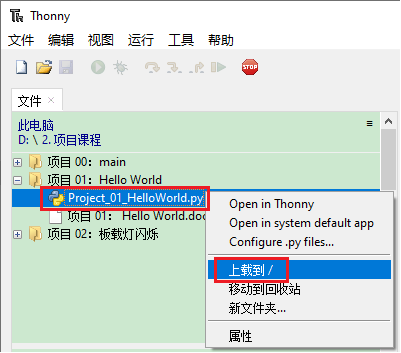

### 2. 下载代码至电脑

在“Raspberry Pi Pico”中，鼠标右键单击选中Project_01_HelloWorld.py，选择“<span style="color: rgb(255, 169, 0);">下载到/</span>”将代码下载到你的电脑。

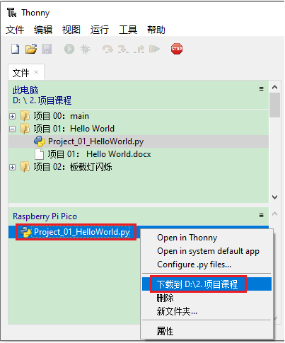

### 3. 删除Raspberry Pi Pico根目录中的文件

在“Raspberry Pi Pico”中，鼠标右键单击选中Project_01_HelloWorld.py，选择“删除”，从Raspberry Pi Pico根目录中删除Project_01_Hello World\.py。

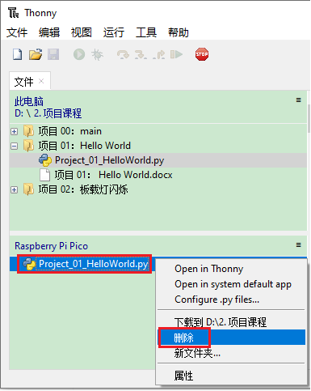

### 4. 删除电脑目录中的文件

在Project 01：Hello World文件夹中，鼠标右键单击选中Project_01_HelloWorld.py，选择“移动到回收站”，即可从Project 01：Hello World文件夹中删除。

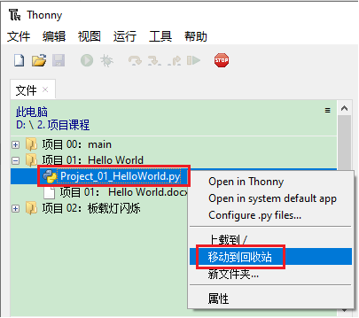

### 5. 创建和保存代码

（1）单击 “文件”→“新文件” 创建并编写代码。

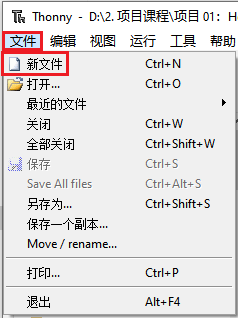

（2）在新打开的文件中输入代码。这里我们以Project_02_Onboard_LED_flashing.py代码为例。

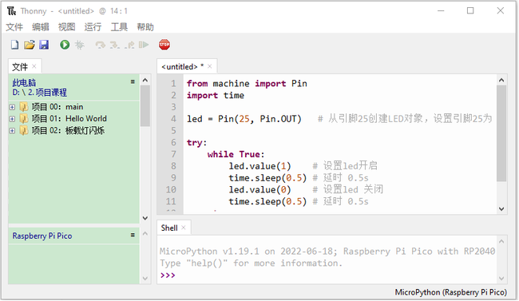

（3）单击菜单栏上的“保存”, 你可以将代码保存到此电脑或Raspberry Pi Pico。

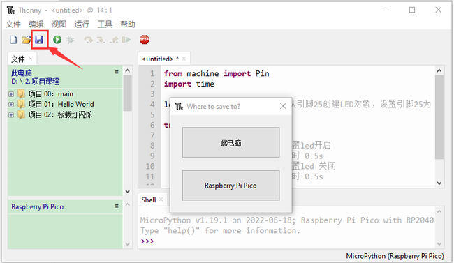

（4）选择“Raspberry Pi Pico”，在新弹出的窗口中输入“main\.py”并单击“确认”。

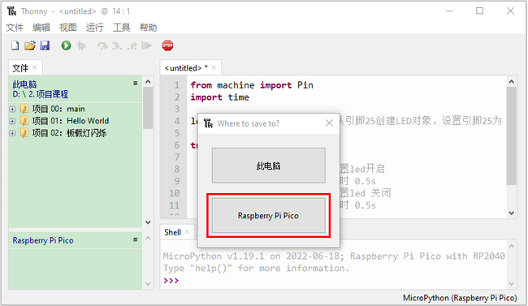

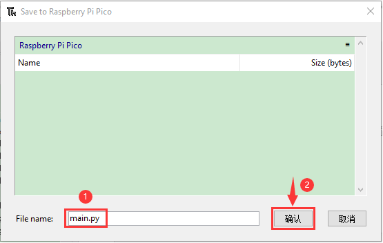

（5）你可以看到代码已经被上传到Raspberry Pi Pico。

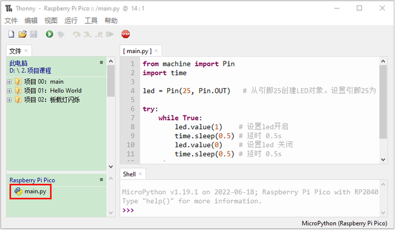

（6）单击 “当前运行脚本”,树莓派Pico板上的LED会周期性闪烁。

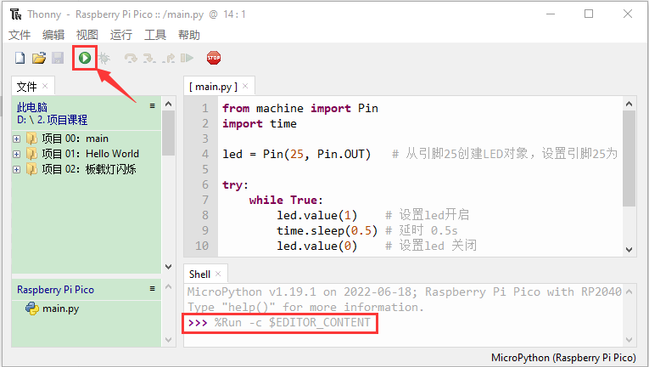


